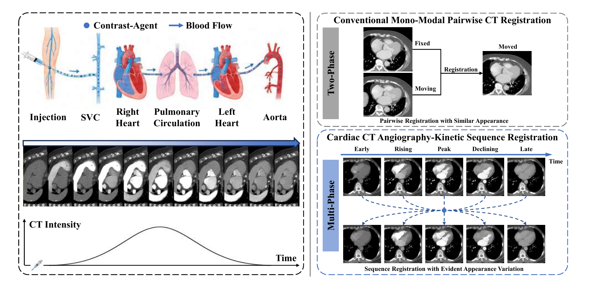
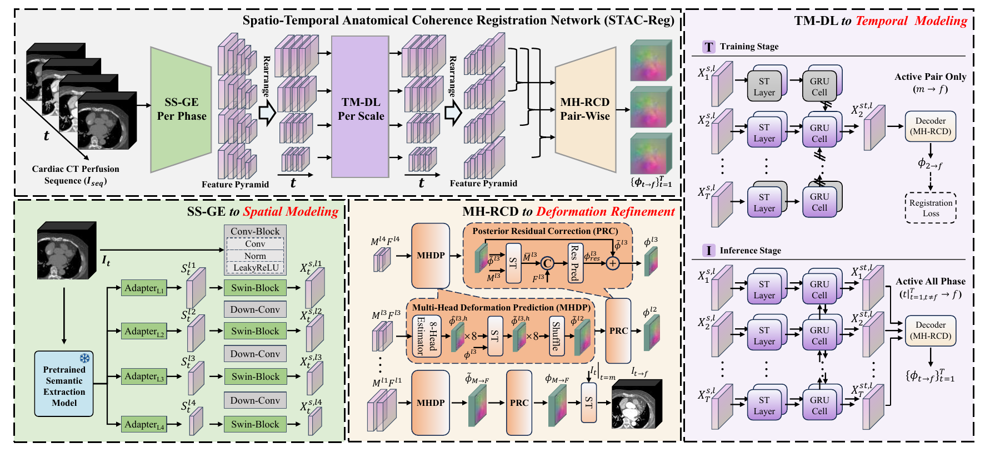
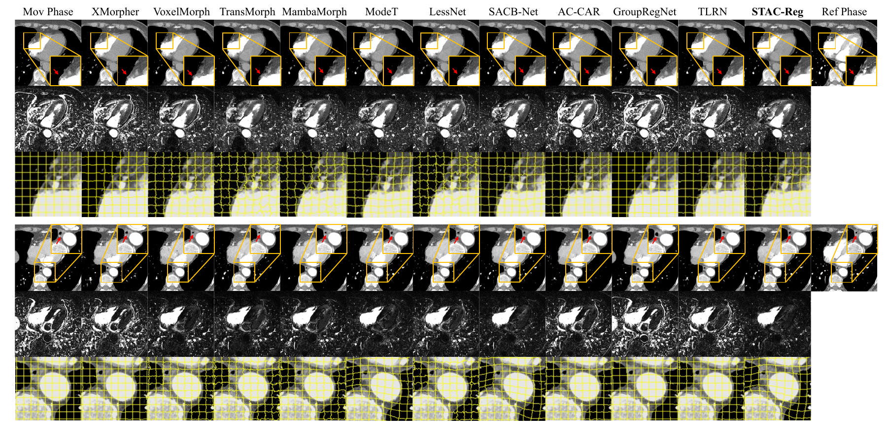

# Spatio-Temporal Modeling with Anatomical Coherence for Cardiac CT Angiography-Kinetic Sequence Registration

### STAC-Reg

**Official project repository for STAC-Reg, a sequence-aware registration framework for cardiac CT angiography-kinetic sequences.**

> [!IMPORTANT]
> This repository currently serves as the project page for our preprint. We are actively organizing and documenting the implementation and intend to release the source code publicly. Training and inference code, configuration files, evaluation scripts, and reproducibility instructions will be added in subsequent updates.

## Overview

Cardiac CT Angiography-Kinetic Sequence Registration (CTASR) aims to align a dynamically acquired cardiac CT sequence to a common anatomical reference. Unlike conventional mono-modal pairwise registration, CTASR must handle both anatomical motion and substantial phase-dependent appearance changes caused by contrast-agent propagation and redistribution.

STAC-Reg addresses two task-specific challenges:

1. **Spatial anatomical instability:** different anatomical structures may exhibit similar local enhancement patterns.
2. **Temporal appearance evolution:** the same anatomical structure may show substantially different appearances across phases.

  

## Method

STAC-Reg follows a sequence-to-pair design: the complete angiography-kinetic sequence is first modeled to learn anatomy-aware spatio-temporal representations, after which every non-reference phase is registered to a selected reference phase.

The framework contains two principal components:

- **Anatomy-Aware Semantic-Guided Architecture (A²SGA)** establishes spatial anatomical coherence under heterogeneous contrast enhancement.
  - **Spatial Semantic-Guided Encoder (SS-GE):** integrates frozen pretrained visual features with multi-scale CT representations to reduce sensitivity to transient contrast changes.
  - **Multi-Head Residual Correction Decoder (MH-RCD):** combines Multi-Head Deformation Prediction (MHDP) with Posterior Residual Correction (PRC) for coarse-to-fine, boundary-sensitive deformation estimation.
- **Temporal Motion-Decoupled Learning (TM-DL)** establishes temporal anatomical coherence by compensating inter-phase motion before aggregating multi-phase information.

  

## Highlights

- We formulate CTASR as a dedicated sequence-registration problem under dynamic contrast-agent evolution.
- We couple anatomy-aware semantic guidance with fine-grained deformation refinement to improve spatial correspondence.
- We decouple motion compensation from temporal aggregation so that sequence information is propagated across anatomically corresponding locations.
- The sequence-to-pair strategy supports variable-length acquisitions during training and full-sequence processing during inference.
- Experiments are conducted on 88 real clinical cardiac CT angiography-kinetic sequences comprising 1,333 three-dimensional volumes.

## Main Results

The following results were obtained on our in-house clinical cardiac sequence test set. Anatomical metrics were computed from independently generated pseudo-labels for seven cardiac structures.

| Type | Method | NCC (%) ↑ | SSIM (%) ↑ | DSC (%) ↑ | HD95 (mm) ↓ | ASSD (mm) ↓ | Non-positive Jacobian (%) ↓ |
|:--|:--|--:|--:|--:|--:|--:|--:|
| Pairwise | TransMorph | 85.38 | 92.51 | 87.10 | 5.33 | 1.47 | 9.27 |
| Pairwise | ModeT | 79.75 | 91.42 | 90.34 | 4.04 | 1.11 | **0.04** |
| Pairwise | SACB-Net | 83.04 | 92.51 | 90.14 | 4.10 | 1.12 | 0.07 |
| Sequence-wise | GroupRegNet | 46.11 | 70.62 | 83.91 | 5.85 | 1.88 | **≤0.01** |
| Sequence-wise | TLRN | 62.06 | 83.02 | 87.31 | 5.34 | 1.47 | 0.44 |
| **Sequence-wise** | **STAC-Reg (ours)** | **86.35** | **93.56** | **91.21** | **3.91** | **1.06** | 0.44 |

STAC-Reg improves DSC by **3.90 percentage points** and NCC by **24.29 percentage points** over the strongest sequence-wise baseline in our evaluation.

  

## Dataset

The study uses an in-house clinical dataset collected at Shanghai General Hospital:

- 88 patient cases and 1,333 3D CT volumes;
- 13-24 temporally ordered phases per case;
- 72 training cases and 16 test cases, split at the patient level;
- seven cardiac structures used for pseudo-label-based evaluation: aorta, left atrium, right atrium, myocardium, left ventricle, right ventricle, and pulmonary artery.

Because the dataset contains clinical patient data and is governed by institutional approval and privacy requirements, it cannot be directly distributed through this repository. We will release the preprocessing protocol and data organization specification to facilitate reproduction on eligible datasets.

## Paper

The preprint link and complete bibliographic information will be added here when publicly available.

**Title:** *Spatio-Temporal Modeling with Anatomical Coherence for Cardiac CT Angiography-Kinetic Sequence Registration*

## Citation

If this work is useful to your research, please consider citing it. A ready-to-use BibTeX entry will be provided once the public preprint record is available.

## License

The source-code license will be published together with the implementation. The paper figures and clinical data are not automatically covered by a future source-code license.

## Acknowledgements

We thank the clinicians and technical collaborators involved in the acquisition, curation, and analysis of the cardiac CT angiography-kinetic sequences used in this study.
